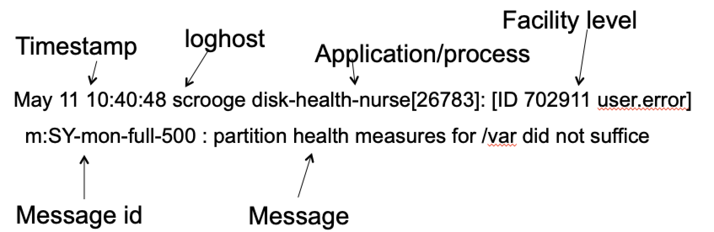
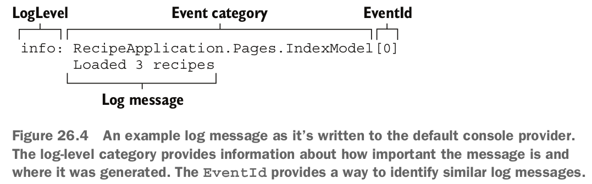
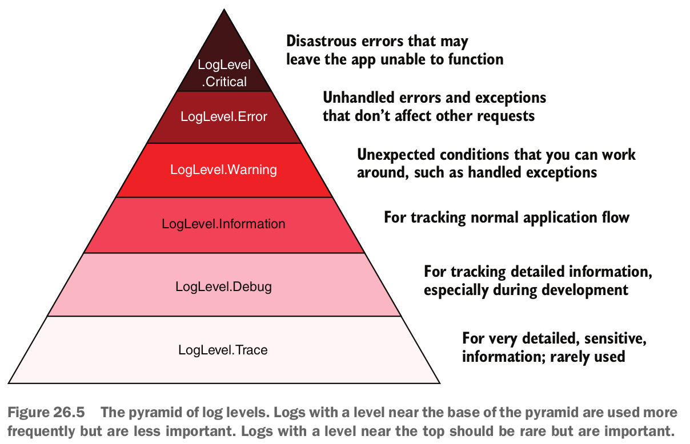
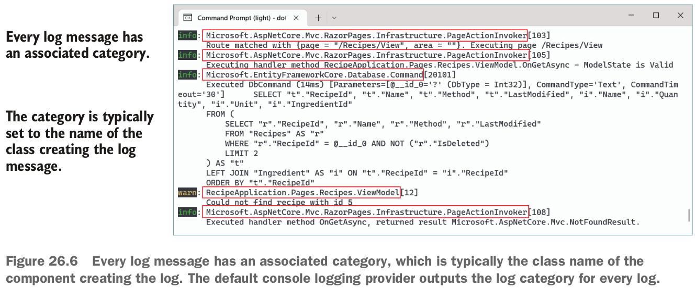
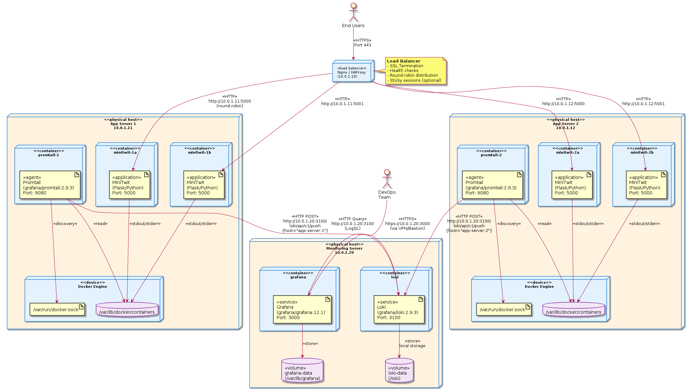
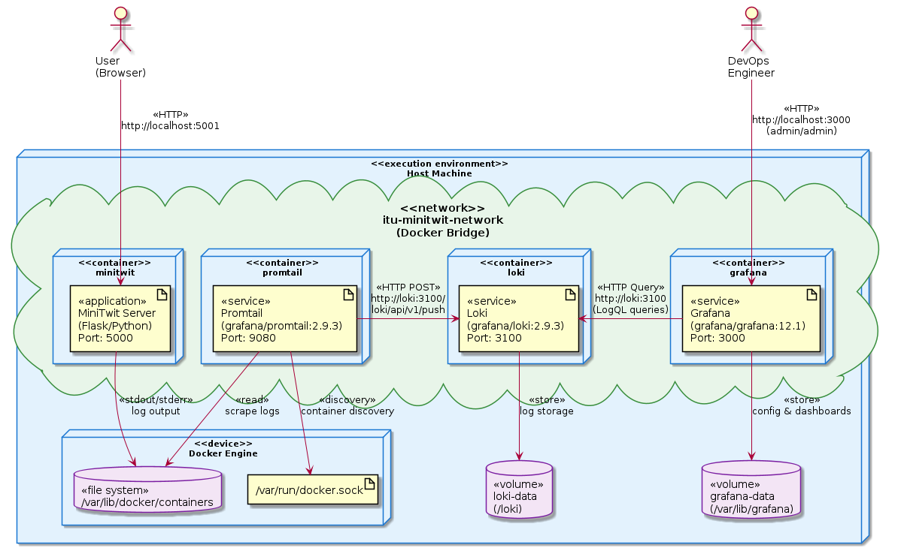

class: center, middle


# DevOps, Software Evolution and Software Maintenance

Helge Pfeiffer, Associate Professor,<br>
[Research Center for Government IT](https://www.itu.dk/forskning/institutter/institut-for-datalogi/forskningscenter-for-offentlig-it),<br>
[IT University of Copenhagen, Denmark](https://www.itu.dk)<br>
`ropf@itu.dk`

---

class: center, middle

# Feedback: The state of your projects?

---

### Release Activity

<object width="100%" data="http://209.38.211.172/release_activity_weekly.svg"></object>

---

### Weekly Commit Activity

<object width="100%" data="http://209.38.211.172/commit_activity_weekly.svg"></object>

---

### Latest processed events?

<object width="100%" data="http://64.226.108.122/chart.svg"></object>

---

### Error plot

<object width="100%" data="http://64.226.108.122/error_chart.svg"></object>

---

## How do you feel it is going with your projects?

---

## Practical Introduction to Logging

In the preparation material, I was asking you:

  > Can you answer the following two questions about the performance of your _ITU-MiniTwit_ with your group?
  >
  >   * Which of your API endpoints is the slowest? How slow is it?
  >   * Where is the time being spent in this endpoint?
  >   * Who tries to log into your server(s)?
  >
  > How do you find out this info?

---

class: center, middle

# Logging

---

## What is Logging?

  > Log \Log\, v. t. [imp. & p. p. {Logged}; p. pr. & vb. n.
  >    {Logging}.]
  >    1. (Naut.), To enter in a ship's log book; as, to log the
  >       miles run. --J. F. Cooper.
  >       [1913 Webster]
  >
  >    2. To record any event in a logbook, especially an event
  >       relating to the operation of a machine or device.
  >       [PJC]
  >
  > Source: [Collaborative International Dictionary of English v.0.48](https://gcide.gnu.org.ua/?q=Logging&define=Define&strategy=.)

--

  > Software logging is the practice of recording different events and activities that occur within a software system, which are useful for different activities such as failure prediction and anomaly detection.
  >
  > [Batoun, Mohamed Amine, et al. _"A literature review and existing challenges on software logging practices: From the creation to the analysis of software logs."_ Empirical Software Engineering 29.4 (2024)](https://www.researchgate.net/profile/Roozbeh-Aghili/publication/381517057_A_literature_review_and_existing_challenges_on_software_logging_practices/links/67d492c72719090652ba14df/A-literature-review-and-existing-challenges-on-software-logging-practices.pdf)

---

## What are logs?

  > Logs are
  > * **streams** of
  > * **aggregated**
  > * **time-ordered** events
  > * collected from **all running processes and backing services**
  >
  > [A. Wiggins _"The twelve-factor app"_](https://12factor.net/logs)

---

## Why Log? Logging for Observability

Last time, we discussed software quality.
One of these qualities was **observability**.

  > In complex, distributed systems, failure is not a matter of if but when. When something fails, your ability to recover quickly depends on how fast you can understand exactly what happened - and that’s where logs have traditionally been our most valuable ally: Our primary forensics tool.
  >
  > https://engineering.theblueground.com/a-software-engineers-guide-to-observability-part-1-logging/

---

## Why to log?

1. Diagnosis
  * Why could the user not login yesterday?
  * Why is the service slow?
2. Understanding
  * How is our system being used?
  * Was our server under attack last night?
3. Audit trails
  * Sometimes logs are legally required, e.g., [banking applications](https://taxation-customs.ec.europa.eu/system/files/2016-09/lat_policy_v3.00.pdf)

--

> * Logging for auditing or analytics reasons, to trace when events have occurred
> * Logging errors
> * Logging nonerror events to provide a breadcrumb trail of events when an error does occur
>
> [A. Lock _"ASP.NET Core in Action"_](https://www.oreilly.com/library/view/asp-net-core-in/9781617294617/)

---

## Why to log?

Incident reports and post-mortem analyses

* Google [We are experiencing Networking issues](https://status.cloud.google.com/incidents/1xkAB1KmLrh5g3v9ZEZ7)
* Google [Google Compute Engine Incident #16007](https://status.cloud.google.com/incident/compute/16007?post-mortem)
* DigitalOcean [App Platform Deployments](https://status.digitalocean.com/incidents/7pxx131dr1qt)
* Microsoft [Azure Incidents](https://azure.status.microsoft/en-us/status/history/)
* Kombit [Driftstatus](https://driftstatus.kombit.dk/)

<!-- https://www.digitaliser.dk/driftsstatus -->

---

## Why to log? Difference to Monitoring?


> Logs and metrics are complementary. [Monitoring] Metrics give you an aggregated view [...]. Logs give you a view of a smaller number of metrics, but give you information about every single request or event.
>
> Metrics are good as a first port of call when dealing with a problem. Combined with well-designed dashboards they allows you to narrow down to which subsystem of which application is behaving oddly. From there you can bring in profiling tools, data mine your logs and cross-check against the source code itself as you deep dive.
>
> https://web.archive.org/web/20190502031321/https://grafana.com/blog/2016/01/05/logs-and-metrics-and-graphs-oh-my/

That is, monitoring is to identify _if_ there is a problem.
Logging is for identifying _why_ there is a problem.

---

## System Logs

---

### Linux Log File Location

On Linux systems, logs are usually stored in `/var/log`.

```bash
$ ls -ltrh /var/log/*.log
```

* `/var/log/syslog` ... _"The syslog file contains general global system messages for the Linux OS."_
--

* `/var/log/auth.log` ... _"The auth.log file contains information regarding authorization and authentication events."_
--

* `/var/log/kern.log` ... _"The kern.log is a good place to look for Linux kernel messages, such as hardware issues or general information related to the Linux kernel."_
--

* `/var/log/dmesg` ... _"The dmesg log contains bootup messages from the host since last boot time. [...] The dmesg log has its own command line application, dmesg, to view the kernel ring buffer in real time."_
--

* `/var/log/dpkg.log` ... contains information about installed and uninstalled packages
* ...

Adapted from [_DevOps for the Desperate_](https://nostarch.com/devops-desperate)

---

### Reading Log Files

* `less` remember that you can inspect text files with a pager application.
  - Useful commands in `less` are:
  - `/` type in your search pattern
  - `n` jump to next match
  - `N` jump to previous match

```bash
sudo less /var/log/auth.log
```

--

* `tail` prints the last lines of a file to stdout
  - Useful switches for `tail` are:
  - `-n, --lines=[+]NUM` _"output the last NUM lines, instead of the last 10; or use -n +NUM to output starting with line NUM"_
  - `-f` _"output appended data as the file grows;"_

```bash
sudo tail -f /var/log/syslog
```

---

### Reading Log Files

* `grep` searches for text patterns in files.
  - Useful switches for `grep` are:
  - `-H, --with-filename` _"Print the file name for each match.  This is the default when there is more than one file to search.  This is a GNU extension."_
  - `-n, --line-number` _"Prefix each line of output with the 1-based line number within its input file."_

For example, find who tries to log into a computer:

```bash
grep "Invalid user" /var/log/auth.log
```

How many remotes tried to log into a computer:

```bash
grep "Invalid user" /var/log/auth.log | awk '{print $10}' | sort | uniq | wc -l
```

---

### Reading Log Files


* `awk` can search for text patterns in files but it is more, a pattern scanning and processing language.

List all IP addresses from remotes connecting to an Apache web server:

```bash
sudo awk '{print $1}' /var/log/apache/access.log
```

List all requests from remotes trying to receive non-existing resources:

```bash
sudo awk '($9 ~ /404/)' /var/log/nginx/access.log
```

<!--
Some example log files for experimentation come from [here](https://github.com/elastic/examples/blob/master/Common%20Data%20Formats/apache_logs/README.md)
```
wget https://raw.githubusercontent.com/elastic/examples/refs/heads/master/Common%20Data%20Formats/apache_logs/apache_logs
```
and [here](https://github.com/elastic/examples/blob/master/Common%20Data%20Formats/nginx_logs/README.md)
```
wget https://raw.githubusercontent.com/elastic/examples/refs/heads/master/Common%20Data%20Formats/nginx_logs/nginx_logs
```
 -->

---

### Linux Kernel Logging

- `dmesg` ... _"print or control the kernel ring buffer"_


Image source: https://devconnected.com/linux-logging-complete-guide/

--

Remember the example from two weeks ago:
Finding if a program was killed (by OOMKiller) due to excessive memory consumption.

```bash
sudo dmesg | grep -i 'killed process'
```

---

class: center, middle

## How to log?

---

### Writing to Log Files?

One could just print to stdout.

```python
@app.after_request
def after_request(response):
    """Closes the database again at the end of the request."""
    g.db.close()
    t_elapsed_ms = (datetime.now() - request.start_time).total_seconds() * 1000

    if t_elapsed_ms > 2000:
        print(
            f"Serving slow request ({t_elapsed_ms})"
            + f" to {str(request.remote_addr)}"
        )

    return response
```

--

But what is the problem with this?

--

Remember:
> Logs are **streams** of **aggregated** **time-ordered** events collected from **all running processes and backing services**
>
> [A. Wiggins _"The twelve-factor app"_](https://12factor.net/logs)

---

### Writing to Log Files? Application Logs

* Your Unix process should just log to stdout.
  - Your program is not responsible of logging to a certain file.
  - That is the responsibility of the person/process starting your program.
* Use the logging library of your standard library.


```python
import logging


logging.basicConfig(level=logging.DEBUG)


@app.after_request
def after_request(response):
    """Closes the database again at the end of the request."""
    g.db.close()
    t_elapsed_ms = (datetime.now() - request.start_time).total_seconds() * 1000

    if t_elapsed_ms > 2000:
        msg = (
            f"Serving slow request ({t_elapsed_ms})"
            + f" to {str(request.remote_addr)}"
        )
        logging.warning(msg)

    return response
```

<!-- https://daniil-berg.github.io/syslogformat/ -->

---

### Writing to Log Files on a Unix Host

For example, in case you are running the _ITU-MiniTwit_ application directly on a server, i.e., not within a Docker container,

```bash
nohup venv/bin/gunicorn --bind 0.0.0.0:5000 minitwit:app > ~/log/minitwit.log 2>&1 &
```

--

What are the semantic differences between the following three calls?
Which one should you use for which purpose?


```bash
nohup venv/bin/gunicorn --bind 0.0.0.0:5000 minitwit:app > ~/log/minitwit.log &
```

```bash
nohup venv/bin/gunicorn --bind 0.0.0.0:5000 minitwit:app >> ~/log/minitwit.log &
```

```bash
nohup venv/bin/gunicorn --bind 0.0.0.0:5000 minitwit:app >> ~/log/minitwit.log 2>&1 &
```

---

### Writing to Log Files on a Unix Host

What was again the meaning of:

- `nohup`
- `>`
- `2>&1`
- `>>`
- `&`

---

### Writing to Log Files on a Unix Host

What was again the meaning of:

- `nohup` ... _"run a command immune to hangups, with output to a non-tty"_
--

- `>` ... redirect output of a program to a given file
--

- `2>&1`
  - This is arcane syntax, you are not the only one confused by it, see [SO _"What does 2>&1 mean?"_](https://stackoverflow.com/questions/818255/what-does-21-mean)
  - _"I find it easier to understand in terms of the Unix syscall API. `2>&1` literally translates as `dup2(1, 2)`, and indeed that's exactly how it works. In the classic unix shells that's all that happens;"_, see [wahern on HackerNews](https://news.ycombinator.com/item?id=47173059)
  - `man dup2` ... `int dup2(int oldfd, int newfd);`
--

- `>>` ... append output of a program to a given file
--

- `&` ... run the process in the background


---

### Writing to Log Files on a Unix Host

If your program is started within a Docker container, just continue to log to stdout.
Do not redirect logs to a file as in the examples above.
The above is for logging from a process that is created directly on a Linux host.

---

## Docker Container Logs

```bash
$ docker logs --help

Usage:  docker logs [OPTIONS] CONTAINER

Fetch the logs of a container

Aliases:
  docker container logs, docker logs

Options:
      --details        Show extra details provided to logs
  -f, --follow         Follow log output
      --since string   Show logs since timestamp (e.g. "2013-01-02T13:23:37Z") or relative (e.g. "42m" for 42 minutes)
  -n, --tail string    Number of lines to show from the end of the logs (default "all")
  -t, --timestamps     Show timestamps
      --until string   Show logs before a timestamp (e.g. "2013-01-02T13:23:37Z") or relative (e.g. "42m" for 42 minutes)
```

```bash
$ docker logs -f minitwit
[2026-03-16 14:41:02 +0000] [1] [INFO] Starting gunicorn 25.1.0
[2026-03-16 14:41:02 +0000] [1] [INFO] Listening at: http://0.0.0.0:5000 (1)
[2026-03-16 14:41:02 +0000] [1] [INFO] Using worker: sync
[2026-03-16 14:41:02 +0000] [1] [INFO] Control socket listening at /usr/src/app/gunicorn.ctl
[2026-03-16 14:41:02 +0000] [8] [INFO] Booting worker with pid: 8
[2026-03-16 14:41:02 +0000] [9] [INFO] Booting worker with pid: 9
[2026-03-16 14:41:02 +0000] [10] [INFO] Booting worker with pid: 10
[2026-03-16 14:41:02 +0000] [11] [INFO] Booting worker with pid: 11
DEBUG:root:Serving request to: 172.19.0.4
WARNING:root:Serving slow request (4070.785) to 172.19.0.4
DEBUG:root:Serving request to: 172.19.0.4
DEBUG:root:Serving request to: 172.19.0.4
--snip--
```

---

### Writing to Log Files?

For important messages or system tools, one can use the `logger` command to enter messages into the system log.

```bash
sudo tail -f /var/log/syslog
```


```bash
logger "Hej there!"
logger --rfc5424=notq "Hej there!"
```

---

### The (BSD) syslog Protocol. [RFC 5424](https://datatracker.ietf.org/doc/html/rfc5424), [RFC 3164](https://datatracker.ietf.org/doc/html/rfc3164)


  > syslog (/ˈsɪslɒɡ/) is a standard for message logging. It allows separation of the software that generates messages, the system that stores them, and the software that reports and analyzes them. Each message is labeled with a facility code, indicating the type of system generating the message, and is assigned a severity level.
  >
  > Source: [Wikipedia](https://en.wikipedia.org/wiki/Syslog)

<table>
<tbody><tr>
<th>Facility code
</th>
<th>Keyword
</th>
<th>Description
</th></tr>
<tr>
<td>0</td>
<td>kern</td>
<td>Kernel messages
</td></tr>
<tr>
<td>1</td>
<td>user</td>
<td>User-level messages
</td></tr>
<tr>
<td>2</td>
<td>mail</td>
<td>Mail system
</td></tr>
<tr>
<td>3</td>
<td>daemon</td>
<td>System daemons
</td></tr>
<tr>
<td>4</td>
<td>auth</td>
<td>Security/authentication messages
</td></tr>
<tr>
<td>5</td>
<td>syslog</td>
<td>Messages generated internally by syslogd
</td></tr>
<tr>
<td>6</td>
<td>lpr</td>
<td>Line printer subsystem
</td></tr>
<tr>
<td>7</td>
<td>news</td>
<td>Network news subsystem
</td></tr>
<tr>
<td>8</td>
<td>uucp</td>
<td><a href="/wiki/UUCP" title="UUCP">UUCP</a> subsystem
</td></tr>
<tr>
<td>9</td>
<td>cron</td>
<td>Cron subsystem
</td></tr>
<tr>
<td>10</td>
<td>authpriv</td>
<td>Security and authentication messages
</td></tr>
<tr>
<td>11</td>
<td>ftp</td>
<td>FTP daemon
</td></tr>
<tr>
<td>12</td>
<td>ntp</td>
<td>NTP subsystem
</td></tr>
<tr>
<td>13</td>
<td>security</td>
<td>Log audit
</td></tr>
<tr>
<td>14</td>
<td>console</td>
<td>Log alert
</td></tr>
<tr>
<td>15</td>
<td>solaris-cron</td>
<td>Scheduling daemon
</td></tr>
<tr>
<td>16–23</td>
<td>local0 – local7</td>
<td>Locally used facilities
</td></tr></tbody>
</table>

---

### Syslog severity levels

<table>
<tbody><tr>
<th>Value</th>
<th>Severity</th>
<th>Keyword</th>
<th>Deprecated keywords</th>
<th>Description</th>
<th>Condition
</th></tr>
<tr>
<td>0</td>
<td>Emergency</td>
<td><code>emerg</code></td>
<td><code>panic</code></td>
<td>System is unusable</td>
<td>A panic condition.</td></tr>
<tr>
<td>1</td>
<td>Alert</td>
<td><code>alert</code></td>
<td></td>
<td>Action must be taken immediately</td>
<td>A condition that should be corrected immediately, such as a corrupted system database.</td></tr>
<tr>
<td>2</td>
<td>Critical</td>
<td><code>crit</code></td>
<td></td>
<td>Critical conditions</td>
<td>Hard device errors.</td></tr>
<tr>
<td>3</td>
<td>Error</td>
<td><code>err</code></td>
<td><code>error</code></td>
<td>Error conditions</td>
<td>
</td></tr>
<tr>
<td>4</td>
<td>Warning</td>
<td><code>warning</code></td>
<td><code>warn</code></td>
<td>Warning conditions</td>
<td>
</td></tr>
<tr>
<td>5</td>
<td>Notice</td>
<td><code>notice</code></td>
<td></td>
<td>Normal but significant conditions</td>
<td>Conditions that are not error conditions, but that may require special handling.
</td></tr>
<tr>
<td>6</td>
<td>Informational</td>
<td><code>info</code></td>
<td></td>
<td>Informational messages</td>
<td>Confirmation that the program is working as expected.
</td></tr>
<tr>
<td>7</td>
<td>Debug</td>
<td><code>debug</code></td>
<td></td>
<td>Debug-level messages</td>
<td>Messages that contain information normally of use only when debugging a program.</td></tr></tbody>
</table>

Source: https://en.wikipedia.org/wiki/Syslog

---

### The Syslog Protocol. [RFC 5424](https://datatracker.ietf.org/doc/html/rfc5424)



---

### Writing to Log Files? System Logs


```python
from syslog import syslog, LOG_WARNING, LOG_USER

@app.after_request
def after_request(response):
    """Closes the database again at the end of the request."""
    g.db.close()
    t_elapsed_ms = (datetime.now() - request.start_time).total_seconds() * 1000

    if t_elapsed_ms > 2000:
        msg = (
            f"Serving slow request ({t_elapsed_ms})"
            + f" to {str(request.remote_addr)}"
        )
        syslog((LOG_INFO | LOG_USER), msg)

    return response
```

https://docs.python.org/3/library/syslog.html


---

### Programming Language-specific Logging Frameworks

* [Apache Log4j](https://logging.apache.org/log4j/2.x/) JVM
* [Standard library](https://docs.python.org/3/library/logging.html) for Python
* [Standard library](https://pkg.go.dev/log) for Go
* [Serilog](https://serilog.net/) for .NET
* ASP.NET Core logging framework, see chapter 10 A.Lock _ASP.NET Core in Action_
...

```csharp
WebApplicationBuilder builder = WebApplication.CreateBuilder(args);
// Adds a new provider using the Logging property on WebApplicationBuilder
builder.Logging.AddConsole()

WebApplication app = builder.Build();

app.MapGet("/", () => "Hello World!");
app.Run();
```

---

## Application Logs



--



Image source: A.Lock _ASP.NET Core in Action_ chapter 10


---

## Application Logs



Image source: A.Lock _ASP.NET Core in Action_ chapter 10

---

## Plain text vs. structured logs

  > Structured or semantic logging attaches additional structure to log
  > messages to make them more easily searchable and filterable. Rather than
  > storing only text, it stores additional contextual information, typically as key-
  > value pairs. JavaScript Object Notation (JSON) is a common format used for
  > structured log messages.
  >
  > A.Lock _ASP.NET Core in Action_ chapter 10

---

### Plain text log example

```
minitwit        | WARNING:root:Serving slow request (4049.7430000000004) to 172.19.0.4
minitwitclient  | DEBUG:urllib3.connectionpool:http://minitwit:5000 "GET /public?p=17 HTTP/1.1" 200 9816
minitwitclient  | DEBUG:root:Client Simulator GET: http://minitwit:5000/Chin Radish
minitwitclient  | DEBUG:urllib3.connectionpool:Starting new HTTP connection (1): minitwit:5000
minitwit        | DEBUG:root:Serving request to: 172.19.0.4
minitwitclient  | DEBUG:urllib3.connectionpool:http://minitwit:5000 "GET /Chin%20Radish HTTP/1.1" 200 9501
minitwitclient  | INFO:schedule:Running job Every 2 seconds do job() (last run: 2026-03-16 14:42:08, next run: 2026-03-16 14:42:10)
minitwitclient  | DEBUG:urllib3.connectionpool:Starting new HTTP connection (1): minitwit:5000
minitwit        | DEBUG:root:Serving request to: 172.19.0.4
minitwit        | WARNING:root:Serving slow request (2038.341) to 172.19.0.4
minitwitclient  | DEBUG:urllib3.connectionpool:http://minitwit:5000 "GET /public?p=31 HTTP/1.1" 200 9719
minitwitclient  | DEBUG:root:Client Simulator GET: http://minitwit:5000/Waneta Ungvarsky
minitwitclient  | DEBUG:urllib3.connectionpool:Starting new HTTP connection (1): minitwit:5000
minitwit        | DEBUG:root:Serving request to: 172.19.0.4
minitwitclient  | DEBUG:urllib3.connectionpool:http://minitwit:5000 "GET /Waneta%20Ungvarsky HTTP/1.1" 200 9683
minitwitclient  | INFO:schedule:Running job Every 2 seconds do job() (last run: 2026-03-16 14:42:12, next run: 2026-03-16 14:42:14)
minitwitclient  | DEBUG:urllib3.connectionpool:Starting new HTTP connection (1): minitwit:5000
minitwit        | DEBUG:root:Serving request to: 172.19.0.4
minitwitclient  | DEBUG:urllib3.connectionpool:http://minitwit:5000 "GET /public?p=36 HTTP/1.1" 200 9810
minitwitclient  | DEBUG:root:Client Simulator GET: http://minitwit:5000/Waneta Ungvarsky
minitwitclient  | DEBUG:urllib3.connectionpool:Starting new HTTP connection (1): minitwit:5000
minitwit        | DEBUG:root:Serving request to: 172.19.0.4
minitwitclient  | DEBUG:urllib3.connectionpool:http://minitwit:5000 "GET /Waneta%20Ungvarsky HTTP/1.1" 200 9683

```

---

### Structured log example


```
elasticsearch | {"@timestamp":"2026-03-13T09:17:51.789Z",
   "log.level": "INFO",
   "message":"adding index template [behavioral_analytics-events-default] for index patterns [behavioral_analytics-events-*]",
   "ecs.version":"1.2.0","service.name":"ES_ECS",
   "event.dataset":"elasticsearch.server",
   "process.thread.name":"elasticsearch[elasticsearch][masterService#updateTask][T#1]",
   "log.logger":"org.elasticsearch.cluster.metadata.MetadataIndexTemplateService",
   "elasticsearch.cluster.uuid":"xfd1BS13ST2Nrd7amEVKjQ",
   "elasticsearch.node.id":"fBMVh4nLR6mqkBMPOAFe3Q",
   "elasticsearch.node.name":"elasticsearch",
   "elasticsearch.cluster.name":"docker-cluster"}
elasticsearch | {"@timestamp":"2026-03-13T09:17:51.796Z", "log.level": "INFO",
   "message":"adding index template [logs] for index patterns [logs-*-*]",
   "ecs.version":"1.2.0",
   "service.name":"ES_ECS",
   "event.dataset":"elasticsearch.server",
   "process.thread.name":
   "elasticsearch[elasticsearch][masterService#updateTask][T#1]",
   "log.logger":"org.elasticsearch.cluster.metadata.MetadataIndexTemplateService",
   "elasticsearch.cluster.uuid":"xfd1BS13ST2Nrd7amEVKjQ",
   "elasticsearch.node.id":"fBMVh4nLR6mqkBMPOAFe3Q",
   "elasticsearch.node.name":"elasticsearch",
   "elasticsearch.cluster.name":"docker-cluster"}
elasticsearch | {"@timestamp":"2026-03-13T09:17:51.830Z", "log.level": "INFO",  "current.health":"RED","message":"Cluster health status changed from [YELLOW] to [RED] (reason: [reconcile-desired-balance]).","previous.health":"YELLOW","reason":"reconcile-desired-balance" , "ecs.version": "1.2.0","service.name":"ES_ECS","event.dataset":"elasticsearch.server","process.thread.name":"elasticsearch[elasticsearch][masterService#updateTask][T#1]","log.logger":"org.elasticsearch.cluster.routing.allocation.AllocationService","elasticsearch.cluster.uuid":"xfd1BS13ST2Nrd7amEVKjQ","elasticsearch.node.id":"fBMVh4nLR6mqkBMPOAFe3Q","elasticsearch.node.name":"elasticsearch","elasticsearch.cluster.name":"docker-cluster"}
elasticsearch | {"@timestamp":"2026-03-13T09:17:51.844Z", "log.level": "INFO",
   "message":"adding index lifecycle policy [metrics]", "ecs.version": "1.2.0","service.name":"ES_ECS","event.dataset":"elasticsearch.server","process.thread.name":"elasticsearch[elasticsearch][masterService#updateTask][T#1]","log.logger":"org.elasticsearch.xpack.ilm.action.TransportPutLifecycleAction","elasticsearch.cluster.uuid":"xfd1BS13ST2Nrd7amEVKjQ","elasticsearch.node.id":"fBMVh4nLR6mqkBMPOAFe3Q","elasticsearch.node.name":"elasticsearch","elasticsearch.cluster.name":"docker-cluster"}
elasticsearch | {"@timestamp":"2026-03-13T09:17:51.867Z", "log.level": "INFO",
   "message":"adding index lifecycle policy [synthetics]", "ecs.version": "1.2.0","service.name":"ES_ECS","event.dataset":"elasticsearch.server","process.thread.name":"elasticsearch[elasticsearch][masterService#updateTask][T#1]","log.logger":"org.elasticsearch.xpack.ilm.action.TransportPutLifecycleAction","elasticsearch.cluster.uuid":"xfd1BS13ST2Nrd7amEVKjQ","elasticsearch.node.id":"fBMVh4nLR6mqkBMPOAFe3Q","elasticsearch.node.name":"elasticsearch","elasticsearch.cluster.name":"docker-cluster"}
elasticsearch | {"@timestamp":"2026-03-13T09:17:51.889Z", "log.level": "INFO",
   "message":"adding index lifecycle policy [90-days-default]", "ecs.version": "1.2.0","service.name":"ES_ECS","event.dataset":"elasticsearch.server","process.thread.name":"elasticsearch[elasticsearch][masterService#updateTask][T#1]","log.logger":"org.elasticsearch.xpack.ilm.action.TransportPutLifecycleAction","elasticsearch.cluster.uuid":"xfd1BS13ST2Nrd7amEVKjQ","elasticsearch.node.id":"fBMVh4nLR6mqkBMPOAFe3Q","elasticsearch.node.name":"elasticsearch","elasticsearch.cluster.name":"docker-cluster"}
elasticsearch | {"@timestamp":"2026-03-13T09:17:51.920Z", "log.level": "INFO",
   "message":"adding index lifecycle policy [365-days-default]", "ecs.version": "1.2.0","service.name":"ES_ECS","event.dataset":"elasticsearch.server","process.thread.name":"elasticsearch[elasticsearch][masterService#updateTask][T#1]","log.logger":"org.elasticsearch.xpack.ilm.action.TransportPutLifecycleAction","elasticsearch.cluster.uuid":"xfd1BS13ST2Nrd7amEVKjQ","elasticsearch.node.id":"fBMVh4nLR6mqkBMPOAFe3Q","elasticsearch.node.name":"elasticsearch","elasticsearch.cluster.name":"docker-cluster"}

```


---

## Log files are getting too big?

* Logging can result in very large data that has to be managed.
* Story: Eventually you will experience or already experienced that you cannot log into your sever anymore
  - Log files grow to multi-GB size in a short amount of time
  - Disk space decreases but nobody monitors for that
  - SSH on the server needs a tiny bit pf space to work
  - Solution? *Delete files on the server without opening a terminal*

---

## Log files are getting too big?

```
LOGROTATE(8)             System Administrator's Manual            LOGROTATE(8)

NAME
       logrotate ‐ rotates, compresses, and mails system logs

SYNOPSIS
       logrotate   [--force]   [--debug]  [--state  file]  [--skip-state-lock]
       [--verbose] [--log file]  [--mail  command]  config_file  [config_file2
       ...]

DESCRIPTION
       logrotate  is  designed to ease administration of systems that generate
       large numbers of log files.  It allows automatic rotation, compression,
       removal, and mailing of log files.  Each log file may be handled daily,
       weekly, monthly, or when it grows too large.

       Normally, logrotate is run as a daily cron job.  It will not  modify  a
       log  more  than  once  in  one day unless the criterion for that log is
       based on the log's size and logrotate is being run more than once  each
       day, or unless the -f or --force option is used.
```

---

## Log files are getting too big?

On an Ubuntu-based Linux, move your `logrotate` configuration files to `/etc/logrotate.d/`
An exemplary `logrotate` configuration file:

```
/var/log/dpkg.log {
        monthly
        rotate 12
        compress
        delaycompress
        missingok
        notifempty
        create 644 root root
}
```

--

An exemplary `logrotate` configuration file from the simulator server


```
/root/log/group*.log {
        weekly
        missingok
        rotate 14
        size 50M
        compress
        compresscmd /bin/bzip2
        compressext .bz2
        delaycompress
        notifempty
        dateext
}
```

---

## What to log?

* **Security Events**
  - Authentication attempts (successful/failed logins, logout, password changes), authorization failures, suspicious activities, account lockouts, privilege escalations, and API key usage
--

* **Business-Critical Operations**
  - User transactions, data modifications (create/update/delete), payment processing, order placements, state changes in workflows, and any operations with financial or legal implications
--

* **Errors and Exceptions**
  - All exceptions with stack traces, handled errors, validation failures, external service failures (database, API calls), timeouts, and recovery attempts
  - This is essential for debugging and troubleshooting
--

* **Performance Metrics**
  - Slow requests or queries, i.e., above a threshold, response times, resource consumption warnings, rate limiting hits, and bottlenecks
  - This helps identify performance degradation before it becomes critical
--

* **System Events**
  - Application startup or shutdown, configuration changes, health check status, background job execution, scheduled task runs, external service connectivity changes, or feature flag toggles


Adapted from:
* https://cheatsheetseries.owasp.org/cheatsheets/Logging_Cheat_Sheet.html
* https://12factor.net/logs

---

## What **not** to log?


**OBS**

> Never log data unless it is legally sanctioned. For example, intercepting some communications, monitoring employees, and collecting some data without consent may all be illegal.
>
> https://cheatsheetseries.owasp.org/cheatsheets/Logging_Cheat_Sheet.html

That is, never log personal information.

--

Remember, your guest lecture on GDPR in BDSA? What does that mean for your logs?

--

* Passwords, API keys, tokens, credit card numbers, personal information (unless anonymized)
* Excessive debug logs in production (they create noise and performance overhead)
* Duplicate information already captured elsewhere
* High-frequency routine operations that provide no actionable insights


---

## What **not** to log?

What you do not log and store cannot possibly be exposed...

[Stored in the cloud: Terabytes of movement data from VW electric cars found](https://www.heise.de/en/news/Stored-in-the-cloud-Terabytes-of-movement-data-from-VW-electric-cars-found-10220700.html)


<!--
https://the-digital-reader.com/amazon-is-recording-everything-you-do-on-your-kindle-heres-how-to-request-the-data/
https://www.reddit.com/r/privacy/comments/i9ne9f/has_anyone_ever_requested_their_amazon_data/
 -->

---

## But what to do when I have logs from multiple hosts?

If you have to manage many different machines with many different (containerized) services, then you do not want to ssh into each machine and manually inspect logs.

Instead, **all** logs should be aggregated in one place.

--

> A twelve-factor app never concerns itself with routing or storage of its output stream. It should not attempt to write to or manage logfiles. Instead, each running process writes its event stream, unbuffered, to stdout. During local development, the developer will view this stream in the foreground of their terminal to observe the app’s behavior.
>
> In staging or production deploys, each process’ stream will be captured by the execution environment, collated together with all other streams from the app, and routed to one or more final destinations for viewing and long-term archival. These archival destinations are not visible to or configurable by the app, and instead are completely managed by the execution environment. Open-source log routers (such as Logplex and Fluentd) are available for this purpose.
>
> [A. Wiggins _"The twelve-factor app"_](https://12factor.net/logs)

---

## But what to do when I have logs from multiple hosts?



---

# An Exemplary Logging System

To get acquainted with a logging system, let's look at one single host first.



---

## Grafana Loki Stack


> Loki is a horizontally-scalable, highly-available, multi-tenant log aggregation system inspired by Prometheus. It is designed to be very cost effective and easy to operate. It does not index the contents of the logs, but rather a set of labels for each log stream.
>
> Compared to other log aggregation systems, Loki:
>
>   * does not do full text indexing on logs. By storing compressed, unstructured logs and only indexing metadata, Loki is simpler to operate and cheaper to run.
>   * indexes and groups log streams using the same labels you’re already using with Prometheus, enabling you to seamlessly switch between metrics and logs using the same labels that you’re already using with Prometheus.
>   * is an especially good fit for storing Kubernetes Pod logs. Metadata such as Pod labels is automatically scraped and indexed.
>   * has native support in Grafana (needs Grafana v6.0).
>
> https://github.com/grafana/loki?tab=readme-ov-file

---

## Grafana Loki Stack

Our exemplary logging stack consists of:

- Our _ITU-MiniTwit_ application
  - It creates logs via the logging library and writes them to stdout.
  - The application is containerized running in a Docker container.
  - Logs are visible on the host machine via `docker logs minitwit`.

---

## Grafana Loki Stack, Promtail

- Promtail is a log collector or log shipper
  - It collects logs from Docker containers by scraping Docker container log files (via `/var/lib/docker/containers`) and the Docker socket (`/var/run/docker.sock`)
  - It ships logs to Loki at http://loki:3100/loki/api/v1/push
- Promtail automatically discovers all running containers, reads their logs from stdout/stderr, adds labels (container name, stream), and forwards them Loki for log storage and aggregation

---

## Grafana Loki Stack, Loki


- Loki is a log storage and aggregation system
  - It stores and indexes log data efficiently, i.e., without full-text indexing as [ElasticSearch would do](https://github.com/itu-devops/itu-minitwit-logging/tree/master).
  - It receives logs from Promtail, which pushes them via HTTP to http://loki:3100/loki/api/v1/push
  - It serves log messages to Grafana as a data source via HTTP queries http://loki:3100
- Loki stores log messages with timestamps and labels and provides a query API for log retrieval using LogQL

LogQL Queries

- `{container="minitwit"}`
- `{container="minitwit"} |= "slow"`


See [documentation](https://grafana.com/docs/loki/latest/query/) for detailed explanations of LogQL

---

## Grafana Loki Stack, Grafana

- Grafana a visualization tool
  - Amongst others, Grafana provides a web interface for querying, viewing, and visualizing logs
  - Users access it via a web browser at http://localhost:3000
  - Logging dashboards can be created via LogQL queries
- In our example, we provide it with a pre-configured data source

---

## Grafana Loki Stack, Promtail EOL

**OBS**

> Promtail is now deprecated and will enter into Long-Term Support (LTS) beginning Feb. 13, 2025. This means that Promtail will no longer receive any new feature updates, but it will receive critical bug fixes and security fixes. [...]
>
> If you are currently using Promtail, you should plan your migration to Alloy. The Alloy migration documentation includes a migration tool for converting your Promtail configuration to an Alloy configuration with a single command.
>
> https://grafana.com/docs/loki/latest/send-data/promtail/

---

### Promtail Configuration

```yaml
server:
  http_listen_port: 9080
  grpc_listen_port: 0
positions:
  filename: /tmp/positions.yaml
clients:
  - url: http://loki:3100/loki/api/v1/push
scrape_configs:
  - job_name: docker
    docker_sd_configs:
      - host: unix:///var/run/docker.sock
        refresh_interval: 5s
    relabel_configs:
      - source_labels: ['__meta_docker_container_name']
        regex: '/(.*)'
        target_label: 'container'
      - source_labels: ['__meta_docker_container_log_stream']
        target_label: 'stream'
```

- `http_listen_port: 9080` ... Promtail's HTTP API listens on port 9080 for health checks and metrics (accessible at http://promtail:9080/metrics)
- `grpc_listen_port: 0` Disables gRPC server, since we push to Loki via HTTP (`url: http://loki:3100/loki/api/v1/push`)
- `  filename: /tmp/positions.yaml` Track which log files have been read and at what position
 - **OBS**: Using `/tmp/` loses positions on container restart, mount to volume in production
- `scrape_configs` find running containers and relabel their names and streams for use in Loki/Grafana

---

### Loki Configuration (exemplary)

```
auth_enabled: false

server:
  http_listen_port: 3100

common:
  path_prefix: /loki
  storage:
    filesystem:
      chunks_directory: /loki/chunks
      rules_directory: /loki/rules
  replication_factor: 1
  ring:
    kvstore:
      store: inmemory

schema_config:
  configs:
    - from: 2020-10-24
      store: boltdb-shipper
      object_store: filesystem
      schema: v11
      index:
        prefix: index_
        period: 24h

limits_config:
  reject_old_samples: true
  reject_old_samples_max_age: 168h
```

---

## What to do now?

  * To prepare for your project work, practice with the [exercises](./README_EXERCISE.md)
  * Do the [project work](./README_TASKS.md) until the end of the week

